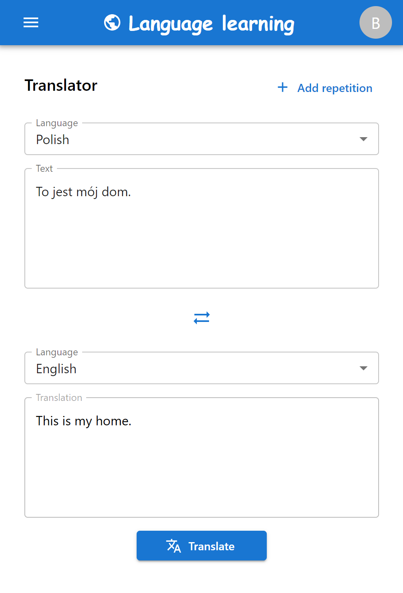

# language-learning
This is an application which allows users for translating texts and learning words or phrases through repetition system.

## Screenshots
_Web application is in an early stage of development_

   

## Technologies
* AWS (Cognito, CloudFront, S3, Lambda, VPC, Translate, RDS)
* Node.js
* React.js
* TypeScript
* Serverless Framework
* TypeORM
* Terraform
* MySQL

## Features
* Log in
* List supported languages
* Translator
* CRUD operations on repetitions (backend)
* Calculations for a repetition result (backend)

To do in web application:
* Add word/phrases to repetitions
* List repetitions
* Modify/delete repetitions
* Learn through repetition system
* Sign up

## Endpoints descriptions
Endpoints are described in [this file](/api/README.md)

## Status
Project is _in progress_

Most important backend endpoints are finished, but the whole repetition system in web application is still to be done.
