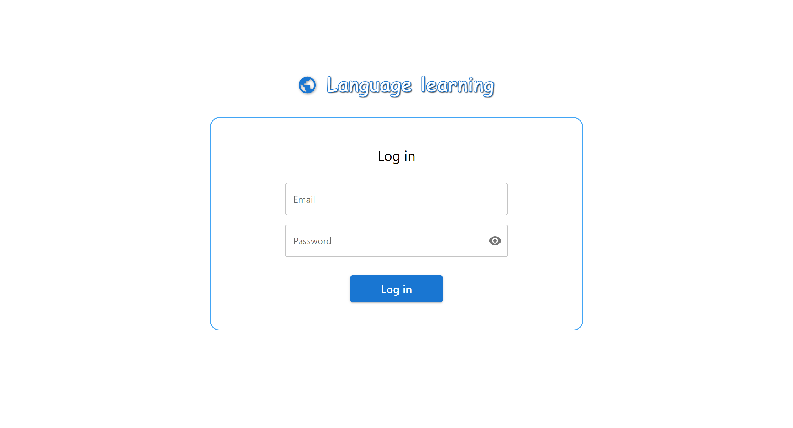
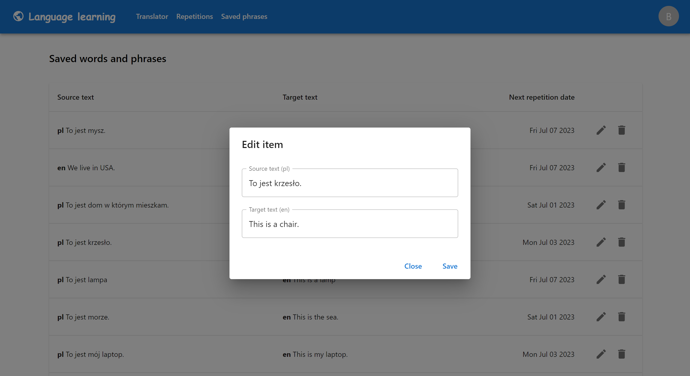

# language-learning
This is an application which allows users for translating texts and learning words or phrases through repetition system.

## Screenshots
  
  

## Technologies
* AWS (Cognito, CloudFront, S3, Lambda, VPC, Translate, RDS)
* Node.js
* React.js
* TypeScript
* Serverless Framework
* TypeORM
* Terraform
* MySQL

## Features
* Logging in
* Listing supported languages
* Translator
* Adding words/phrases to repetitions
* Learning through repetition system
* Calculations of a next repetition date for a repetition result
* List of saved repetitions
* Modifying repetitions
* Deleting repetitions

## Endpoints
You can find endpoints descriptions [here](/api/README.md)

## Status
Project is _in progress_
