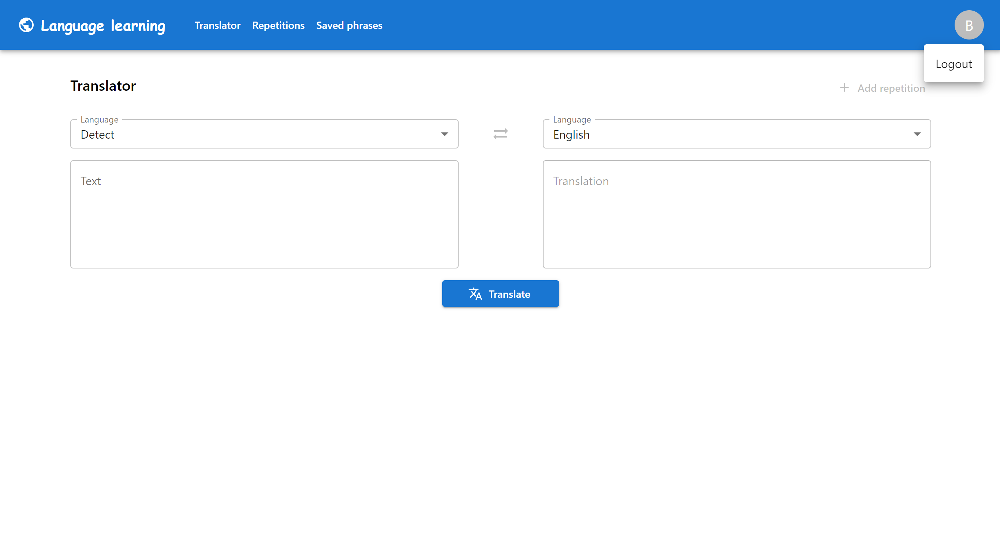

# language-learning-web
This is a web application for a language learning system. The development process is still in progress.

Existing features:
* Log in
* List supported languages
* Translator

To do:
* Add word/phrases to repetitions
* List repetitions
* Modify/delete repetitions
* Learn through repetition system
* Sign up

## Screenshots

